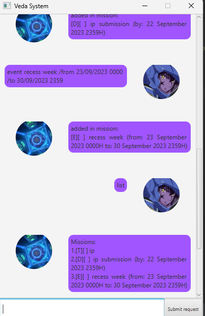

# Veda User Guide
Welcome to Veda System user guide. 

Veda is a task management companion system that aids you in keeping tracking of your different tasks.

You can refer to this user guide if
* You are new to the system and want to learn what features Veda has to offer
* You have questions regarding certain features
* You got problems that need troubleshooting

Without further ado, let's dive into the Veda user guide!

## Getting started
### Setting up
**Note: Veda can only be run on a computer.**

Firstly, you will need to ensure that your computer is operating `java 11`.
You can check that your computer is on the right version by opening your command prompt and typing `java -version` .

If your computer is not running the right java version or does not have java installed, do head over to this 
[website](https://www.oracle.com/sg/java/technologies/javase/jdk11-archive-downloads.html) and install.

After that, download and install the file **Veda.jar** from here.

### Using Veda for the first time
There are 2 main ways of using Veda: double-clicking the .jar file icon or opening it using CLI

**Icon**

Find the Veda.jar file in your computer and double-click on its icon to run the application.

**CLI**

To run Veda using your computer command prompt, first `cd` to access the directory that Veda.jar is stored in.

E.g. If Veda.jar is in your downloads/ directory, use `cd Downloads/`.

Upon accessing the directory that Veda.jar file is in, type in your command prompt `java -jar Veda.jar`.

**Note:** This may lead to some scary lines appearing on the command prompt, but it is normal.


## Features 
Veda features a comprehensive set of list to meet your task management needs on the go!

1) View task
2) Update task
3) Delete task
4) Add task

Tasks are further categorised as Todo, Deadline and Event tasks to cater to your different needs!



### View task
Views all the tasks currently stored.

### Update task
Edits the task at the specific index with a new description, by, from and to (If applicable)
without having to delete and adding back.

### Delete task
Delete task at the specified index

### Add task
Add a new task into the task list for tracking.

### Mark/unmark task as done/undone respectively
Mark task as completed and revert its status back to incomplete if required.


## Usage

### View task
**Command:**`list`
Display all the tasks currently being tracked.


### Update task
To update
1) todo: `update [task index] [new description]`
2) deadline: `update [task index] [new description] /by [dd/MM/yyyy HHmm]`
3) event: `update [task index] [new description] /from [dd/MM/yyyy HHmm] /to [dd/MM/yyyy HHmm]`

**Note:** The type of commands to use depends on the type of task at the specific task index.
Ie. If the task at index 1 is a todo, the appropriate command would be **update 1 [new description]**


### Delete task
**Command:**`delete [task index]`

For example, we wish to delete a task at index 1: `[T][ ] task`
```
delete 1
```

Upon successful execution of command:
```
Noted. I have removed the following mission:

[T][ ] task
```

Here are some possible scenarios that you may encounter when you use the command wrongly
1) No index given
```
There is no given task index.
```

2) If task index is invalid (Not within the task list indices)
```
Invalid index! Please ensure you correctly key in your target index.
```

### Add task
To add
1) todo: `todo [new description]`
2) deadline: `deadline [new description] /by [dd/MM/yyyy HHmm]`
3) event: `event [new description] /from [dd/MM/yyyy HHmm] /to [dd/MM/yyyy HHmm]`

**Note:** All the arguments have to be present for the respective commands to be executed successfully.


### Mark task as done
**Command:**`mark [task index]`

For example, we have an incomplete task at index 1: `[T][ ] task`
```
mark 1
```

Upon successful execution of command:
```
Mission status updated! Mission completed successfully
[T][X] task
```

Here are some possible scenarios that you may encounter when you use the command wrongly

1) If task status is complete initially:
```
Mission has been completed previously.
```

2) If task index is invalid (Not within the task list indices)
```
Invalid index! Please ensure you correctly key in your target index.
```

### Unmark task as done
**Command:**`unmark [task index]`

For example, we have a marked task at index 1: `[T][X] task`
```
unmark 1
```

Upon successful execution of command:
```
Mission status updated! Mission completion status reverted
[T][ ] task
```

Here are some possible scenarios that you may encounter when you use the command wrongly

1) If task status is incomplete:
```
Mission is already marked as undone!
```

2) If task index is invalid
```
Invalid index! Please ensure you correctly key in your target index.
```

### Exit
To exit the system, simply type in `bye` and submit.


## Glossary
